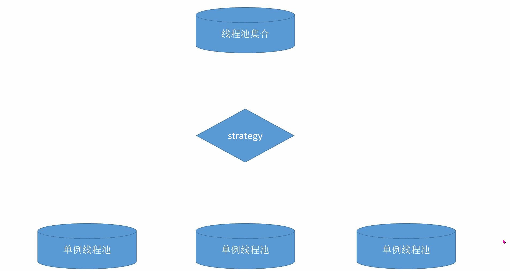
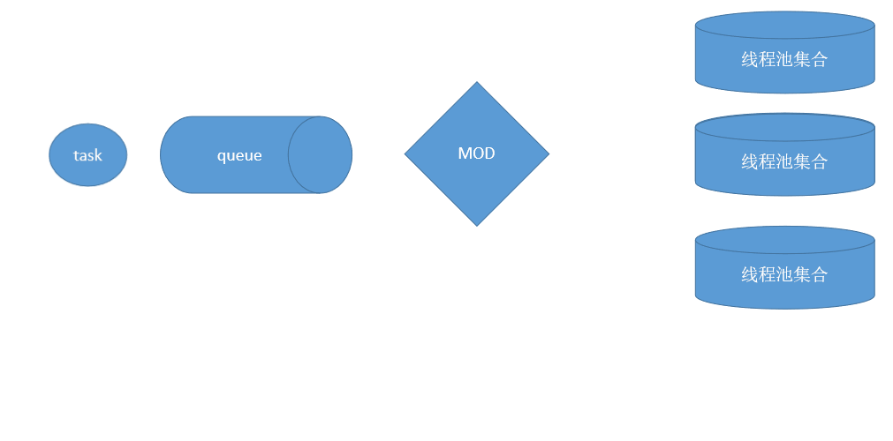

# 项目说明
***一款简单的 0依赖线程池集合执行Java™ 库***

在JAVA项目中,常用MQ转发来自项目的大量消息;在特定消费场景中,需要保证Queue中的消息严格顺序消费,比如订单的"创建、支付、发货、收货"等场景

以RocketMQ为例说明,单个Queue中的消息顺序入队,那么在消费时只需要保证该Key对应的消息严格顺序消费即可,言外之意不同维度的Key无关顺序性

那么只需要提供一个按Key选择Thread执行的消费模型即可,所以ExecutorGroup应运而生,并且提供2套消费模型

## ExecutorGroup模型
ExecutorGroup为 ***java.util.concurrent.ThreadPoolExecutor*** 的维护者,内部维护多个ThreadPoolExecutor,组合为ExecutorGroup

其中ThreadPoolExecutor的core thread只有一个,目的就是为了达到执行的顺序性,支持线程选择策略,默认IDLE;另支持MOD,MIXED等策略,也支持自定义

### 线程执行选择示意图

## MultiExecutorGroup模型 
MultiExecutorGroup为ExecutorGroup的维护者,内部维护多个Group,组合为MultiExecutorGroup,默认只支持以Thread维度的MOD策略

### 线程池组选择示意图
